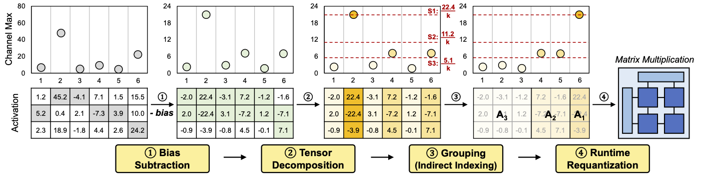

# Tender: Accelerating Large Language Models via Tensor Decomposition and Runtime Requantization
[[paper](https://arxiv.org/abs/2406.12930)]



## Overview

This repository contains the code for the ISCA'24 paper `Tender: Accelerating Large Language Models via Tensor Decomposition and Runtime Requantization`. Some of the code snippets are referenced from SmoothQuant (ICML'23) and GPTQ (ICLR'23) GitHub repositories.

## Abstract

Large language models (LLMs) demonstrate outstanding performance in various tasks in machine learning and have thus become one of the most important workloads in today's computing landscape. However, deploying LLM inference poses challenges due to the high compute and memory requirements stemming from the enormous model size and the difficulty of running it in the integer pipelines. In this paper, we present Tender, an algorithm-hardware co-design solution that enables efficient deployment of LLM inference at low precision. Based on our analysis of outlier values in LLMs, we propose a decomposed quantization technique in which the scale factors of decomposed matrices are powers of two apart. The proposed scheme allows us to avoid explicit requantization (i.e., dequantization/quantization) when accumulating the partial sums from the decomposed matrices, with a minimal extension to the commodity tensor compute hardware. Our evaluation shows that Tender achieves higher accuracy and inference performance compared to the state-of-the-art methods while also being significantly less intrusive to the existing accelerators.

## Directory Structure

- calibration: Calibration scripts for generating scale factor, channel bias, and group index.
  - opt: Calibration script for OPT.
  - llama: Calibration script for Llama-2 / LLaMA
- models: Tender implementation.
- scripts: Scripts for running the perplexity and accuracy evaluation.

## Setup

### Prerequisite

Fetch llama-2 from [here](https://llama.meta.com/llama-downloads). You may also need to convert the model to huggingface format using the `convert_llama_weight_to_hf.py` in `transformers/src/transformers/models/llama`.

```sh
conda create -n tender python=3.9
conda activate tender
conda install ninja
pip install -r requirements.txt
git clone -b v4.35-release https://github.com/huggingface/transformers.git
cd transformers
pip install -e .
cd .. && bash setup.sh
```

NOTE: `setup.sh` renames the original model code from `modeling_xx.py` to `modeling_xx_orig.py` (e.g., `modeling_opt.py` -> `modeling_opt_orig.py`) in the transformers library.

### Calibration

Tender requires offline calibration to determine the scale factors, biases, and channel indices. To calibrate the models, run the following command:

```sh
cd calibration/opt
bash generate_bias.sh
bash generate_scale_factor.sh

export LLAMA2_PATH=/path/to/llama-2
cd calibration/llama
bash generate_bias.sh
bash generate_scale_factor.sh
```

The above code generates channel bias, scale factor, and channel group index for each row chunk.

## Perplexity Evaluation

To reproduce Tables 2 and 3, run the following command:

```sh
export LLAMA2_PATH=/path/to/llama-2
cd scripts
python table_2.py
python table_3.py
```

## Accuracy Evaluation

To reproduce Table 7, you need to get the source code of lm-evaluation-harness and MX emulation library:

```sh
git clone https://github.com/microsoft/microxcaling.git
cd microxcaling
git checkout 94741 && pip install --no-deps .
cd ..
git clone https://github.com/EleutherAI/lm-evaluation-harness.git
cd lm-evaluation-harness
git checkout 1736d && pip install -e .
# apply the patch for supporting Tender
cp ../lm-eval.patch . && git apply lm-eval.patch
```

After setting up the libraries, run the following command:

```sh
cd scripts
python table_7.py
```

The results might be slightly different depending on the GPU.

## Citation

If you find Tender useful and relevant to your research, please kindly cite our paper. 

```bibtex
@inproceedings{lee-isca24,
  title={Tender: Accelerating Large Language Models via Tensor Decomposition and Runtime Requantization},
  author={Lee, Jungi and Lee, Wonbeom and Sim, Jaewoong},
  booktitle={Proceedings of the 51st Annual International Symposium on Computer Architecture},
  year={2024}
}
```
